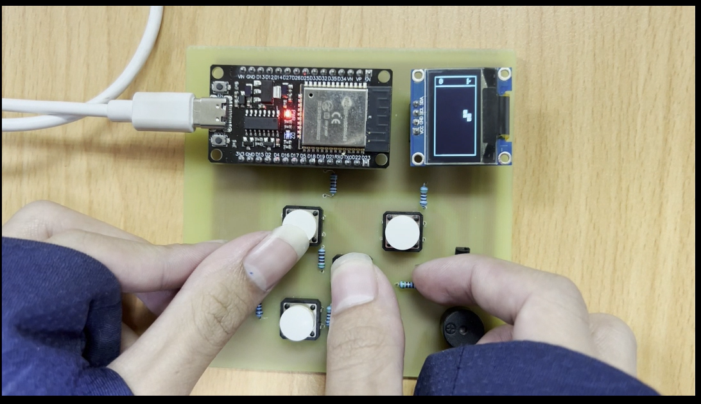

# Tetris Game on ESP32 with OLED Display

## Project Description

This project implements the classic Tetris game on the ESP32 30-pin development board using a 128x64 OLED display (SSD1306). The project focuses on embedded graphics, input handling, and low-level game logic implementation in C++ with the Arduino framework. The game is rendered in real time and includes support for multiple tetromino shapes, movement, rotation, collision detection, line clearing, and sound effects.

## Hardware Requirements

- ESP32 Dev Board (30-pin)
- SSD1306 OLED display (I2C, 128x64 resolution)
- Buzzer for sound output (connected to GPIO 19 by default)
- Push buttons (for left, right, rotate, drop controls)
- Power supply via USB or battery (depending on use case)

## Software Specifications

- Written in C++ using the Arduino platform
- Uses Adafruit GFX and Adafruit SSD1306 libraries
- Game logic includes:
  - Piece generation and rotation (including S, Z, L, T, I, O shapes)
  - Collision detection
  - Row completion and clearing
  - Score system (optional)
  - Sound feedback for actions (click, erase)
- Game rendering is optimized for monochrome OLED screen

## Video Demo 
**Simulation Video** ( 🎬 Click the image below to watch the demo )
[](youtube.com/watch?v=TtYGKUvJRxQ)

**Hardware Demo** ( 🎬 Click the image below to watch the demo )
[](https://youtu.be/cieGwUBqGL4)

## File Structure

```bash
 ┣ 📂Teris_Game_Esp32_30pin
 ┃  ┗ 📜Teris_Game_Esp32_30pin.ino     # Main Arduino sketch
 ┣ 🧾Tetris-Game-Console               # Project documentation
 ┗ 📄README.md          
